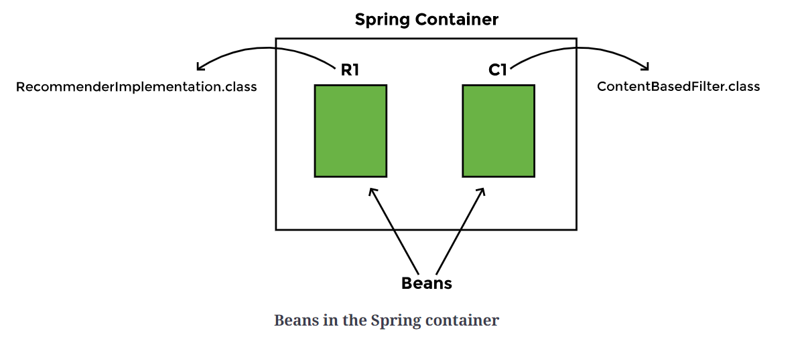
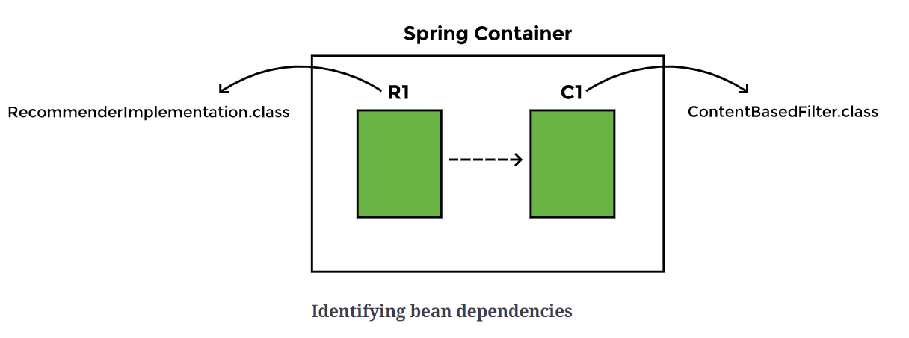
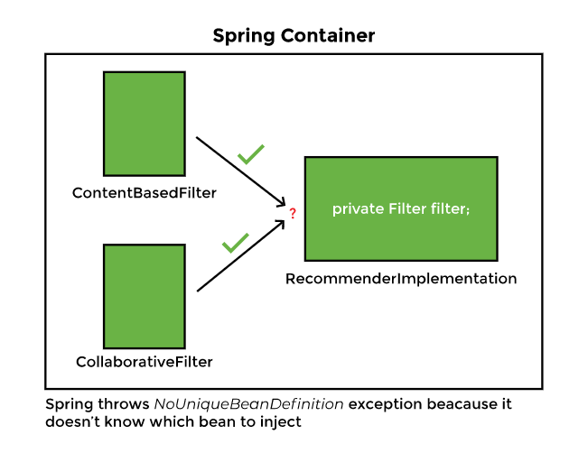
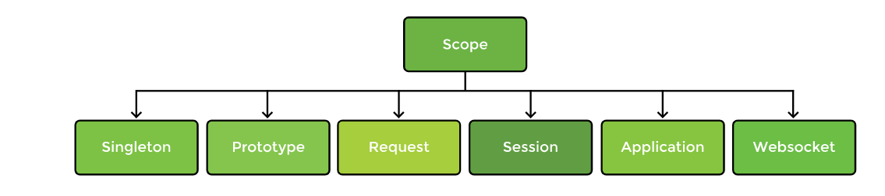

## Spring learing 

# What is Spring?
The Spring framework is an open-source Java application framework, which is based on two key principles: dependency injection and Inversion of Control. Spring has the ability to autowire the dependency at run time, which allows the developer to write loosely coupled code.

Spring framework uses metadata in the form of xml file or java annotations to create objects and identifies dependencies, thereby producing a ready-to-use application.

      Metadata      Business Object 
      
      ------------------------------
            SPRING CONTAINER
      ------------------------------
                  |
                  |
                  |
                  V
            ---------------
        Ready to use application 
            ---------------
            
A typical application has a lot of classes and dependencies
* Tight coupling
* Loose coupling

## Tight coupling 
Tightly coupled code involves creating an instance of the dependency inside the class
 
      public class ClassA {
          DependencyOption1 dependency1 = new DependencyOption1();
          //...
      }
      public class DependencyOption1 {
          //...
      }
      public class DependencyOption2 {
          //...
      }
      
 
 Problems can arise when we want to use a different option for the dependency. Suppose if we ClassA wants to rely on different dependency
 This entails changing the code of ClassA, which would be a disadvantage of using tightly coupled code.
 
 ## Loose coupling 
A better way would be to implement an interface. This will remove the direct instantiation of the DependencyOption, and instead, ask for the type of filter as an argument to the constructor.
 
      interface DepedencyOption {
          //method definitions
      }
      public class DependencyOption1 implements DepedencyOption {
          //implement interface methods
      }
      public class ClassA {

          DepedencyOption dependency;

          public ClassA(DepedencyOption dependency) {
              this.dependency = dependency;
          }

          //...
      }

This way ClassA is not dependent on a specific type of dependency and can be used with both a DependencyOption1 and DependencyOption2. The above code snippet is an example of loosely coupled code. Loose coupling has a number of advantages.

The Spring framework take cares of writing the above code on its own. Spring creates objects and populates dependencies. As a programmer, you only have to tell which objects it has to create and what the dependencies of each object are.

*Spring inverts the control by taking responsibility for populating the dependency. This is referred to as Inversion of Control (IoC). Spring is a dependency injection framework that promotes loosely coupled code.

# Spring History 

# Spring terminology 
### Beans
   Beans are the objects of classes that are managed by Spring.
   Spring manages all the dependencies of an object and instantiates the object after injecting the required dependencies. The @Component annotation is the most common method of defining beans.
   
      @Component
      public class ClassA {

      }

### Autowiring
its a process of identifying the dependency, looking for match and populating the dependency. 
Spring uses @Autowire annotation to find the dependency and inject into other bean. Spring throws error if it finds more then one dependency unless developer explicitly defines it. 

      @Component
      class ClassA(){
          @Autowired
          private Dependency dependency;
          //...
      }

      @Component
      class DependencyOption1 implements Dependency {

      }

### Dependency injection
Dependency injection is the process of looking up the beans that are needed for a specific bean to function and injects them as a dependency. Spring can perform dependency injection by using constructor or by using a setter method.

### Inversion of control

Traditionally, the class which needed the dependency created an instance of the dependency. The class decided when to create the dependency and how to create it. For example, DependencyOption1 class is a dependency of ClassA class, which creates its object:

      class ClassA{

          private DependencyOption1 dependency1 = new DependencyOption1();
          //...
      }

Spring takes this responsibility from the class and creates the object itself. The developer simply mentions the dependency and the framework takes care of the rest.

      class ClassA{

          private Dependency dependency;
          //...
      }

control moves from the component that needs the dependency to the framework. The framework takes the responsibility for finding out the dependencies of a component, ensuring their availability and injecting them in the component. This process is called Inversion of Control.

             Traditional Approach                                 Inversion of control 
      ----------------------------------------             ----------------------------------------
       ClassA ----creates------> Dependency               ClassA <----Injects------ Dependency 

### IoC container 

An IoC container is a framework that provides the Inversion of Control functionality. The IoC container manages the beans. For the above mentioned example, it creates an instance of the Dependency class, then creates an instance of ClassA class, and then injects the Dependency object as a dependency into the ClassA object.

Spring offers two implementations of the IoC container:

*Bean factory
*Application context

Both of them are interfaces that have different implementations available. Application context is the typical IoC container in the context of Spring. Spring recommends using it unless there is a memory concern, like in a mobile device. If available memory is low, bean factory should be used.

### Bean factory
The basic version of the Spring IoC container is bean factory. It is the legacy IoC container and provides basic management for beans and wiring of dependencies. In Spring, bean factory still exists to provide backward compatibility.

### Application context
Application context adds more features to the bean factory that are typically needed by an enterprise application. It is the most important part of the Spring framework. All the core logic of Spring happens here. It includes basic management of beans and wiring of dependencies as provided by the bean factory.

# Spring Architechture 

Spring framework is made of multiple modules which are grouped together in layers as shown below.
its built in modular way which enables developer to choose specific module instead of using a whole framework. 
## Spring modules 

### Spring core container 
this contains Beans, Core, Context, and Spring Expression Language (SpEL). These modules provide fundamental functionality of the Spring framework, like Inversion of Control (IoC), dependency injection, internationalization as well as support for querying the object at run time.

### Data access / integration 
Spring has very good integration with data and integration layers, and provides support to interact with databases. It contains modules like JDBC, ORM, OXM, JSM, and Transactions.
* The JDBC (Java Database Connectivity) module allows the data layer to interact with databases to get data or store data, or to interact with other systems without the need of cumbersome JDBC coding. Spring JDBC is very straightforward as compared to plain JDBC and makes the code very short.

* The ORM (Object Relational Mapping) module provides support to integrate with ORM frameworks including Hibernate and JPA.

* The JMS (Java Messaging Service) module talks to other applications through the queue to produce and consume messages.

* The OXM (object-XML mapping) module makes the object-to-XML transformation easy by providing useful features.

* The transaction management module provides support for successful rollback in case a transaction fails.

### Spring Web 
It contains the Web, Servlets, Portlets, and Sockets modules to support the creation of a web application. Spring offers a web framework of its own called Spring MVC.

### Test
The Test module handles the cross cutting concern of unit testing. The Spring Test framework supports testing with JUnit, TestNG, as well as creating mock objects for testing the code in isolation.

### AOP 
The AOP Module provides the Aspect oriented programming functionality to address cross cutting concerns like security, logging in application. 
Spring has its own module i.e Spring AOP which provides basic aspect oriented programming functionality. This can be integrated with AspectJ to achieve advanced AOP features.

# Spring Project 
Sr No. | Project | Description |
--- | --- | --- |
1 | Spring Boot | used to develop micro services, it provides nice features like startup project, auto configuration, actuator etc  |
2 | Spring Cloud | used to develop cloud native application that can be dynamically configured and deployed. Provide common pattern used in distributed system  |
3 | Spring Data | used to access SQL  and NoSQL database |
4 | Spring Integration | it allows enterprise applications to be connected easlity using messaging  |
5 | Spring Batch | used to handle large volumes of data and functionality like ability to restart, ability to read from and write to different systems, chunk processing, parallel processing, and transaction management. |
6 | Spring Security | provides authentication and authorization features |
7 | Spring Session  | supports multiple sessions in a single browser instance, manages session information and makes it easeir to share session data between services in the cloud regardless of the platform/container.  |
8 | Spring Mobile | offers device detection and progressive rendering options that make mobile web application development easy. |
9 | Spring Android | facilitates the development of Android applications |

# Advantages 
* Flexibility and support of integration with other framework  
      Spring modules are not dependent on one another and offer a developer the freedom to pick and choose according to the requirements of the application.
      Spring offers its own MVC framework, SpringMVC, it also offers integration with other MVC frameworks. 
* Removes plumbing code   
      Spring removes plumbing code and lets the programmer focus on the application logic.
* Promotes testable code  
      Spring framework enables writing testable code. It offers good integration with JUnit and Mockito frameworks, which lets us write unit tests quickly and easily. The core feature of Spring is dependency injection and if it is used properly, writing unit tests for the code becomes very easy.
* Up to date and adopt lateset technology trends   
      Spring is able to stay current and adapt to changes in development. For example, microservices and cloud services have evolved in the last decade. Spring has come up with projects to keep up with the trend, like Spring Boot, which helps with designing microservices

# Spring basics

## Creating a Project
Earlier building a new spring project was quite hard, we had to decide all maven dependency to use, 
set up the configuration for xml or java, install the tomcat server etc. 

Spring boot comes up with very good new feature and quick setup to start new project. 
Spring boot is actually a spring framework along with embedded servers. it removes the need for 
XML Configuration. 

    Spring Boot ===> Spring Framework  + Embedded server - Manual configuration

Spring initializr can be used to create a spring boot project , where we can simply select the dependencies and create
a basic project structure with maven/gradle build specification. project can be downloaded a zip and can be imported in 
different IDEs like Eclipse or Intellij etc

When the import process finishes, the following hierarchy can be seen:

* src/main/java where the Java code will be written.
* src/main/resources where the application properties are written.
* src/test/java where the tests will be written.

The Maven Dependencies folder lists all the dependencies. Spring has automatically been added as a dependency. Spring-boot, spring-context, spring-beans, and spring-core can also be seen among other dependencies autowired by the Spring Initializr.

# Managing Beans and Dependency 

we have created objects of RecommenderImplementation class and two classes implementing the Filter interface. We are binding the objects together in the constructor. Our code is now loosely coupled as we are passing the name of the filter to be used as a constructor argument.

Spring automates the above process of creating objects and binding them together. It takes the responsibility of creating instances of classes and binding instances based on their dependencies. The instances or objects that Spring manages are called beans. To manage objects and dependencies, Spring requires information about three things:

* Beans
* Dependencies
* Location of beans

Spring uses annotation for managing beans and its dependency
#### @Component
- using this would let Spring create and manage objects
  we want Spring to manage objects of RecommenderImplementation and ContentBasedFilter only, so we will add the @Component annotation at two places in the code:
  
        import org.springframework.stereotype.Component;
        
        @Component
        public class RecommenderImplementation {
        //…
        }

        import org.springframework.stereotype.Component;
        
        @Component
        public class ContentBasedFilter implements Filter {
        //…
        }
The Spring container will have two beans, one of type <I>RecommenderImplementation</I> and the other of type <I>ContentBasedFilter</I>.

#### @Autowired
- Now Spring needs to know is the dependencies of each object. 
  The @Autowired annotation is used for this purpose
  
  In our application, the <I>ContentBasedFilter</I> class is a dependency of the <I>RecommenderImplementation</I> class.

        import org.springframework.stereotype.Component;
        import org.springframework.beans.foctory.annotation.Autowired;
        
        @Component
        public class RecommenderImplementation {
        
            @Autowired
            private Filter filter;
            // ...
        }

The @Autowired annotation tells Spring that <I>RecommenderImplementation</I> needs an object of type Filter. 
In other words, <I>Filter</I> is a dependency of <I>RecommenderImplementation</I>.

#### @ComponentScan
Now, Spring requires from the developer is the location of the beans so that it can find them and autowire the dependencies
The @ComponentScan annotation is used for this purpose. This annotation can be used with or without arguments. It tells Spring to scan a specific package and all of its subpackages. In our case, all the files that contain beans are in the same package, com.gn.springbasics, so we want Spring to do a component scan on this package.

Since we are using Spring Boot, 
it uses the @SpringBootApplication annotation in the MovieRecommenderSystemApplication file. 
This annotation is equivalent to the following three annotations:
* <B>@Configuration</B>, which declares a class as the source for bean definitions
* <B>@EnableAutoConfiguration</B>, which allows the application to add beans using classpath definitions
* <B>@ComponentScan</B>, which directs Spring to search for components in the path specified

        @SpringBootApplication = #Configuration + @EnableAutoConfiguration + @ComponentScan

#### @SpringBootApplication
this tells Spring to scan all the files in the package where the class with this annotation is present. 
It also scans any sub-packages of the package where it is placed.

When we use the above mentioned annotations, the following line in our code becomes redundant as it is automatically done by Spring:

        RecommenderImplementation recommender = new RecommenderImplementation(new ContentBasedFilter());

The beans that Spring creates are managed by the Application Context. 
We can get information about a bean from the Application Context. 
The run method returns the ApplicationContext, which can be assigned to a variable appContext. 
Then the getBean method of ApplicationContext can be used to get the bean of a particular class. 
We will create a local variable recommender and assign the bean to it as follows:

        ApplicationContext appContext = SpringApplication.run(MovieRecommenderSystemApplication.class, args);
        
        RecommenderImplementation recommender = appContext.getBean(RecommenderImplementation.class);
        
        String[] result = recommender.recommendMovies("ABC");

Instead of us having to create an instance of the RecommenderImplementation class, Spring Application Context creates the beans. We can simply pick it up from there and use it to execute the RecommendMovies method.

This might look complex to a beginner, but consider for a moment an application that has hundreds of beans, each having a number of dependencies. The fact that we do not have to explicitly create beans and manually wire in the dependencies makes the job of a developer very easy.

To understand what goes on in the background, we will run the application in debug mode. 
This can be done by changing the <I>application.properties</I> file in <I>src/main/resources</I>.

        Logging.level.org.springframework = debug

A summary of the actions is reproduced below:
* Loading source class... 
  The package is being searched. Spring starts with a component scan to find anything with @Component as well as other annotations
  
* Identified candidate component class... 
  Spring identifies two candidates which have the @Component annotation as we only used it in two places in our code.
  
* Creating shared instance... 
  Spring starts creating instances of the beans. 
  It creates beans that do not have any dependency first. 
  
      Creating shared instance of singleton bean 'movieRecommenderSystemApplication'
      Creating shared instance of singleton bean 'contentBasedFilter'
  
* Now Spring can autowire the dependency using the constructor that we have provided and creates the RecommenderImplementation bean.
        
        Creating shared instance of singleton bean 'recommenderImplementation'
        Autowiring by type from bean name 'recommenderImplementation' via constructor to bean named 'contentBasedFilter'

To better understand these annotations, play around with the code below and see what error messages Spring throws when some of the annotations are missing. The error message can be found at the end of the log.

## Autowire in-depth By Type : @Primary

In the last lesson, we saw Spring manage two beans of the RecommenderImplementation and ContentBasedFilter classes for us. In this lesson, we will add another bean and see how Spring can dynamically choose a bean if it finds two matches of the same type.

1. Add the @Component annotation on the CollaborativeFilter class to declare it a bean. Now both implementations of the Filter interface are beans. Previously, when Spring searched for a dependency to be autowired in the RecommenderImplementation object, it only found one bean of matching type. Now when we run the application, it fails to start.

        org.springframework.beans.factory.NoUniqueBeanDefinitionException: No qualifying bean of type 'com.gn.springbasics.mrs.Filter' available: expected single matching bean but found 2: collaborativeFilter,contentBasedFilter
        
        Parameter 0 of constructor in com.gn.springbasics.mrs.RecommenderImplementation required a single bean, but 2 were found:
        - collaborativeFilter: defined in file [C:\Users\Anuja\IdeaProjects\spring-example\movie-recommender-system\target\classes\com\gn\springbasics\mrs\CollaborativeFilter.class]
        - contentBasedFilter: defined in file [C:\Users\Anuja\IdeaProjects\spring-example\movie-recommender-system\target\classes\com\gn\springbasics\mrs\ContentBasedFilter.class]
        
        Action:
        Consider marking one of the beans as @Primary, updating the consumer to accept multiple beans, or using @Qualifier to identify the bean that should be consumed

2. One way Spring can choose between two beans of the same type is by giving one bean priority over the other. The @Primary annotation is used for making a component the default choice when multiple beans of the same type are found.
   Using @Primary is called autowiring by type. We are looking for instances of type Filter.
   
3. If we make both beans primary by adding the @Primary annotation to both implementations of the Filter interface, we will get an error, This happens because Spring doesn't know which one to inject in the RecommenderImplementation object. The error message states “more than one 'primary' bean found among candidates: [collaborativeFilter, contentBasedFilter]”.

## Autowire in-depth By Name 
Let's look at another autowiring approach known as autowiring by name and see which approach has higher priority; by name or by type.

Another approach is autowiring by name where we specify the bean that is to be used by name. In this approach, while creating an object, the dependency is injected by matching the name of the reference variable to the bean name. The developer has to ensure that the variable name is the same as its bean name.
1. We will begin by omitting the @Primary annotation from the CollaborativeFilter class. Now to let Spring know which bean to use, change the variable name in the RecommenderImplementation class to match the bean name as follows:

        @Autowired
        private  Filter contentBasedFilter;

Now when the application is run, it chooses the ContentBasedFilter bean for autowiring. When Spring finds two beans of the same type (Filter), it determines that the bean to inject is the one whose name matches the one used with the @Component annotation for that bean. In other words, the variable name (contentBasedFilter) matches the bean name (ContentBasedFilter).

2. As an exercise, let’s see what happens if the bean name and variable names are different. Let's change the name of the variable to filterObj.

When the application is run, autowiring does not take place.

3. We have seen two autowiring approaches so far. To see which autowiring approach takes precedence, we will use the @Primary annotation on ContentBasedFilter class and use autowiring by name by changing the name of the variable of type Filter in RecommenderImplementation class to collaborativeFilter.
   The application chooses a content-based filter, showing that @Primary has a higher priority.

This is because @Autowired annotation tries to resolve dependency by type first. If it fails to resolve a conflict and finds more than one bean of the same type then it tries to resolve it by name.

The autowiring by name approach is advantageous when we want to use one bean in one situation and another bean in some other situation. Using @Primary will always give preference to one bean, which is impractical if we want to use different beans in different scenarios.

## Autowiring In-depth: @Qualifier
Let's examine the @Qualifier annotation for autowiring and compare it to @Primary.

### @Qualifier
Like @Primary, the @Qualifier annotation gives priority to one bean over the other if two beans of the same type are found. The bean with the @Qualifier annotation qualifies to be injected as a dependency. The @Qualifier annotation can be used in a scenario when we have multiple objects of the same type and autowiring by name cannot be used because the variable name doesn't match any bean name.

1. We will use the name CBF for ContentBasedFilter. Add the @Qualifier annotation in two places, the RecommenderImplementation class where the dependency is defined, and the ContentBasedFilter class.

        @Autowired
        @Qualifier("CBF")
        private  Filter filter;
   
        ..............
   
        @Component
        @Qualifier("CBF")
        public  class ContentBasedFilter implements Filter{
        //...
        }

2. We can add the @Qualifier annotation on the CollaborativeFilter class too. Let’s give this bean the name CF.

        @Autowired
        @Qualifier("CF")
        private  Filter filter;
   
        ....................
   
        @Component
        @Qualifier("CF")
        public  class CollaborativeFilter implements Filter{
        //...
        }

This time, the CollaborativeFilter bean qualifies to be autowired. Depending upon which filter is required in a given scenario, we can change the @Qualifier annotation in the RecommenderImplementation class.

### Comparison with @Primary 
The @Qualifier annotation takes precedence over the @Primary annotation. 

@Primary annotation should be used if there is one clear favorite to be used in a majority of situations. In some cases, one algorithm might be more efficient or more important than the rest and is declared as the primary choice. The bean with @Primary gets chosen unless another bean is required, which can be specified with @Qualifier. The bean with @Qualifier is only used to request an "alternate" bean in case the primary choice is not required.

@Autowired annotation resolves dependencies by type. If there are more than one beans of the same type, a conflict arises. We have seen three different approaches to resolve conflicts. They can be resolved using the @Primary annotation, renaming the variable to match the name of the class, or by using the @Qualifier annotation

## Constructor and Setter Injection

So far we have learnt that Spring framework identifies dependencies and wires them in. Spring framework gives the developer control over how beans are wired in. There are a variety of options to choose from. We will focus on constructor injection and setter injection.

To show the two different ways of dependency injection, we will create a copy of the RecommenderImplementation class and call it RecommenderImplementation2. One will be used to show constructor injection while the other will demonstrate setter injection.

We will move the @Autowired annotation to the constructor or setter method to direct Spring which one to use.

1. We have a constructor in the RecommenderImplementation class that initializes the filter to be used for finding movie recommendations. Autowiring the dependency using a constructor is called constructor injection.
   
        @Autowired
        @Qualifier("collaborativeFilter")
        public RecommenderImplementation( Filter filter) {
        //...
        }
Adding the @Qualifier annotation to the constructor like above results in an error message that says, “The annotation @Qualifier is disallowed for this location”. To resolve this error, we will move the @Qualifier annotation to the argument list of the constructor and put it right in front of the property that we want to be autowired.

Adding the @Qualifier annotation to the constructor like above results in an error message that says, “The annotation @Qualifier is disallowed for this location”. To resolve this error, we will move the @Qualifier annotation to the argument list of the constructor and put it right in front of the property that we want to be autowired.

        @Autowired
        public RecommenderImplementation(@Qualifier("collaborativeFilter") Filter filter) {
        //...
        }

When the application is run, Spring injects the CollaborativeFilter bean in the RecommenderImplementation class using the constructor. 
We get the “constructor invoked…” message.

2. Another way to wire in a dependency is by using a setter method. We will create a setter method in the RecommenderImplementation2 class called setFilter as follows:
  
        public void setFilter(Filter filter) {
        this.filter = filter;
        System.out.println("Setter method invoked..");
        }

When the application is run, Spring injects the ContentBasedFilter bean in the RecommenderImplementation2 class using the setFilter method. The “setter invoked…” message is also displayed.

3. We have seen two dependency injection methods above but Spring can inject dependencies even without a constructor or setter. This is called field injection.

        public class RecommenderImplementation {
        @Autowired
        private Filter filter;
        
            //...    
        }

Using field injection, on one hand, keeps the code simple and readable in the absence of plumbing code, but on the other hand, 
it is unsafe because Spring can set private fields of the objects. 
Testing can become inconvenient because we need a way to perform dependency injection for testing. 
Another disadvantage is that a developer may add a lot of optional dependencies which can make the application complex. 
If there was a constructor, then each additional dependency would result in increasing the number of arguments of the constructor.

### Difference in constructor and setter injection 
- Setter injection is more readable as it specifies the name of the dependency as the method name
- if the number of setter methods increases then it increases the boiler plate code.
- Setter injection is used to <B>avoid</B> the <I>BeanCurrentlyInCreationException</I> raised in case of a circular dependency, because unlike constructor injection where dependencies are injected at the time when context is loaded, setter injection injects dependencies when they are needed.
- Constructor injection ensures that all dependencies are injected because an object cannot be constructed until all its dependencies are available. It also ensures immutability as the state of the bean cannot be modified after creation

# Bean scope 
The Spring container manages beans. The term bean scope refers to the lifecycle and the visibility of beans. It tells how long the bean lives, how many instances of the bean are created, and how the bean is shared.

## Types of bean scopes
There are six types of scopes: singleton, prototype, request, session, application, and websocket.

The singleton and prototype scopes can be used in any application while the last four scopes are only available for a web application. In this lesson, we will focus on singleton and prototype bean scopes only
The default scope of a bean is singleton, in which only one instance of the bean is created and cached in memory. Multiple requests for the bean return a shared reference to the same bean. In contrast, prototype scope results in the creation of new beans whenever a request for the bean is made to the application context.

In our movie recommendation system example, we have two implementations of the Filter interface, namely ContentBasedFilter and CollaborativeFilter. We will use them to show the differences between singleton and prototype bean scope.

### Singleton

Application context manages the beans and we can retrieve a bean using the getBean() method. If we request the application context for the ContentBasedFilter bean three times as shown, we get the same bean:

        //Retrieve singleton bean from application context thrice
        ContentBasedFilter cbf1 = appContext.getBean(ContentBasedFilter.class);
        ContentBasedFilter cbf2 = appContext.getBean(ContentBasedFilter.class);
        ContentBasedFilter cbf3= appContext.getBean(ContentBasedFilter.class);
        
        System.out.println(cbf1);
        System.out.println(cbf2);
        System.out.println(cbf3);

As can be verified from the output, all beans are the same. The application context did not create a new bean when we requested it the second and third time. Rather, it returned the reference to the bean already created. Pictorially, it can be shown as follows:

                                                SPRING
        ContentBasedFilter cbf1  |         |                     |
        ContentBasedFilter cbf2  |   ==>   |  ContentBaseFilter  |
        ContentBasedFilter cbf3  |         |                     |

Singleton bean scope is the default scope. It is used to minimize the number of objects created. Beans are created when the context is loaded and cached in memory. All requests for a bean are returned with the same memory address. This type of scope is best suited for cases where stateless beans are required. On the contrary, prototype bean scope is used when we need to maintain the state of the beans.

### Prototype
Now we will change the scope of the CollaborativeFilter bean from singleton to prototype. For this, we will use the @Scope annotation

        //Option 1
        @Scope(“Prototype”)
        
        //Option 2
        @Scope(ConfigurableBeanFactory.SCOPE_PROTOTYPE)

This time the application context will return three different objects. It will create a new object every time we invoke the getBean() method.

                                                SPRING
        ContentBasedFilter cbf1  |  ---->  |  ContentBaseFilter  |
        ContentBasedFilter cbf2  |  ---->  |  ContentBaseFilter  |
        ContentBasedFilter cbf3  |  ---->  |  ContentBaseFilter  |

* Spring creates a singleton bean even before we ask for it while a prototype bean is not created till we request Spring for the bean. 
* It is important to note that there is a difference between the Spring singleton and the Gang of Four (GoF) singleton design patterns. The singleton design pattern as specified by the GoF means one bean per JVM. However, in Spring it means one bean per application context.

# Mixing Bean scope
## Singleton bean with prototype dependency
Now that we understand the concept of singleton and prototype bean scopes, we can move on to an interesting problem of mixing bean scopes. Sometimes, a bean has singleton scope but its dependency has prototype scope. An example is the content-based filter which recommends movies based on item-to-item similarity. Our basic implementation of the content-based filter compares different movies and assigns a similarity score. Hence, Movie is a dependency of the ContentBasedFilter class.

The ContentBasedFilter bean has singleton scope because we need only one instance of the filter. However, the Movie bean has prototype scope because we need more than one object of this class.

            Singleton                   Prototype
                                    | ---> Movie
        ContentBasedFilter -------> | ---> Movie
                                    | ---> Movie

Example - 
1. The ContentBasedFilter class has a dependency on Movie class. It also has a getter method for the dependency (getMovie)
2. The Movie class has variables for storing movie name, genre and producer, as well as a static member instances to maintain the global count of instances created. The variable instances is incremented in the constructor. The scope of the Movie class is prototype because we want multiple objects of this class in the ContentBasedFilter class.
3. In the main method, we will get the ContentBasedFilter bean from the application context and then use it to retrieve the Movie bean thrice.
4. The Movie bean has been injected in the ContentBasedFilter class using @Autowired annotation, but it does not yield desired results

The same Movie bean is returned every time. Moreover, the number of instances of the prototype bean created is two as the Movie constructor is called twice. As mentioned in the previous lesson, a singleton bean is created when the context is loaded. The Movie constructor was called by Spring when it was creating the ContentBasedFilter bean using constructor injection. The prototype bean is injected into the singleton bean at the time of creation of the singleton bean when the container initializes it. This explains the following messages in the output:
        
        Movie constructor called        
        ContentBasedFilter constructor called

When a prototype bean is injected into a singleton bean, it loses its prototype behavior and acts as a singleton. The same instance of the bean is returned by the application context every time it is requested.

The second "Movie constructor called" message is displayed because the prototype bean now acts as a singleton bean and Spring creates the bean at the time of initialization of the container, rather than when we request it for the bean

         ------ContentBasedFilter---
        |                           |
        |                           |
        |          Movie            |
        |                           |
        |                           |
        |___________________________|

## PROXY
Right now, Spring cannot inject the prototype bean into the singleton bean after it has been created
This problem can be solved in a number of ways. One of them is by using a proxy. We declare the bean with prototype scope as a proxy.

    @Scope(value=ConfigurableBeanFactory.SCOPE_PROTOTYPE, proxyMode=ScopedProxyMode.TARGET_CLASS)

The prototype bean doesn't get autowired into the singleton bean at the time of its creation. Instead, a proxy or placeholder object is autowired. The proxy adds a level of indirection. When the developer requests the prototype bean from Spring, a new instance of the prototype bean is created and is returned by the application context. The proxy mode allows Spring container to inject a new object into the singleton bean.

         ------ContentBasedFilter---
        |                           |
        |                |----------|-----> Movie
        |          Proxy |----------|-----> Movie
        |                |----------|-----> Movie
        |                           |
        |___________________________|
        Proxy injected in place of prototype bean

As can be seen from the output, the singleton bean constructor is called when the ContentBasedFilter object is initialized, but the Movie constructor isn't called at that time. The Movie constructor is called whenever the getMovie() method is called.

## Lookup
Another method is by using the @Lookup annotation on the getMovie() method. This annotation tells Spring to return an instance of Movie type. It is essentially the same as beanFactory.getBean(Movie.class).

One thing to consider is that singleton scope minimizes the number of objects created so the scope should only be changed where necessary. If there are more objects, there will be an impact on the memory used as well as on garbage collection

# ComponentScan
let's see how Spring searches for beans found in different packages.
Spring does a component scan to search for the beans that it manages. In a Spring Application, the @ComponentScan annotation without any argument tells Spring to scan the current package as well as any sub-packages that might exist.

In a Spring Boot application, this happens implicitly. The @SpringBootApplication annotation is a combination of three annotations:

* @Configuration
* @EnableAutoConfiguration
* @ComponentScan

@SpringBootApplication
1. by default, searches the package as well as all the sub-packages where it is present.
2. If a bean is present in a package other than the base package or its sub-packages, it will not be found. 
3. If we want Spring to find beans defined in other packages, we need to use the @ComponentScan annotation and provide the path of the package where we want Spring to look for the beans.

@ComponentScan
this is used to guide Spring to search the package, where the dependent bean is present, 
we need to add the @ComponentScan annotation and mention the path of the package:

    @ComponentScan("com.gn.springbasics.mrs.exp09")

This will let Spring detects the dependent bean in defined package only since we explicitly specified the package 
to be searched.

### Include and exclude filters 
* @ComponetScan can be used to include or exclude certain packages from being scanned.
* Exclude filters are used to stop Spring from auto-detecting classes in the component scan.
* There are different types of filters that make use of custom annotations, interfaces, regular expressions, and AspectJ expressions.
* Spring also allows the creation of custom filters, e.g., find only those beans whose names are a certain length
* If we want Spring to detect multiple dependent beans, we can use the include filter of type REGEX and provide the path of the 
  package where the differnet beans are present.

    @ComponentScan(includeFilters = @ComponentScan.Filter (type= FilterType.REGEX , pattern="com.gn.springbasics.mrs.exp09.*"))

* Our REGEX pattern will evaluate to all beans declared with @Component annotation in the exp09 package. 
Now when the application is run, beans from two different packages(current package and exp09) are successfully detected.
  
# Bean lifecycle - @PostConstruct, @preDestroy
Spring manages the entire lifecycle of beans from the time they are created till the time they are destroyed. 
Two of the lifecycle callback methods are the 
- post-initialization
- pre-destruction methods

## @PostConstruct
* When Spring creates a bean, the first thing it does is autowire the dependencies. If the developer wants to perform a task after the dependencies have been populated, it can be done using the @PostConstruct annotation.
* A method with this annotation works like the init method.
* @PostConstruct tells Spring to call the method for us once the object has been created.
* The method can have any name and its return type is always void
* After the bean is created, we can initialize the contents of the bean, load data, establish a database connection, or connect to a web server.
* The PostConstruct method is only called after all the dependencies have been populated.

        | Container started | --> | Bean Initialization | --> | Dependency injection | --> | Post Construct Method | --> | Bean is ready|

## PreDestroy
* The callback method that is executed just before the bean is destroyed.
* The method having this annotation is called when the bean is in the process of being removed from the container. 
* All cleanup stuff can be performed in this method
* A method with the @PreDestroy annotation can be used to release resources or close a database connection.

        | Container Shutdown | --> | Method with @Predestroy annotation | --> | Bean destroyed|

## Lifecycle of prototype beans
- Spring manages the entire lifecycle of singleton beans but it does not completely manage the lifecycle of prototype beans. 
- This is because there might be a large number of prototype instances and the container can become overwhelmed keeping track of them.
- The Spring container creates the prototype beans and hands them over when requested. Thereafter, it is the responsibility of the application to destroy the bean and free up any resources that it has acquired.

# Contexts and Dependency Injection Framework
- Contexts and Dependency Injection (CDI) is an interface that standardizes dependency injection for Java.
- It defines different annotations like @Named, @Inject, @Scope, @Singleton, etc., that are used for injecting dependencies in beans.
- @Named is used to define a bean,
- @Inject is used for autowiring one bean into another
- The comparable Spring annotations are @Component and @Autowired
- Different CDI implementation frameworks provide support and functionality for these annotations. Spring supports most of the annotations defined by CDI.
  * To be able to use CDI annotations in our Spring application, we need to add a dependency in the pom.xml file below the spring-boot-starter dependency as follows:

        <dependency>
            <groupId>javax.inject</groupId>
            <artifactId>javax.inject</artifactId>
            <version>1</version>
        </dependency>
    
  ### @Named and @Inject
  * The comparable Spring annotation for @Named is @Component, and for @Inject, it is @Autowired.
  * This means we can replace the @Component from the RecommenderImplementation, ContentBasedFilter, and CollaborativeFilter classes and use @Named to declare components. In the same way, the Filter dependency declared using @Autowired can be declared using @Inject.
  * Other annotations provided by CDI are @Qualifier, @Scope, and @Singleton. The @Qualifier annotation is similar to the one we have seen in Spring and is used to break ties if two beans of the same type qualify to be injected in a dependency.
  * @Scope is used to set the scope of the bean, similar to the @Scope annotation in Spring. 
  * The @Singleton annotation is used to explicitly set the scope to singleton in CDI annotation. In Spring, we can specify singleton scope using the @Scope annotation.

* Both Spring and CDI annotations provide the same functionality. The only difference is that if the application is migrated to another framework, the CDI annotations can still be used, whereas Spring annotations are specific to a Spring API.
* People often prefer CDI annotations because CDI is a Java EE standard.

# Spring application configuration
The Movie Recommender System we have used in this course was created using Spring Boot. Let’s look at how Spring can be run using its core features.

## Spring-core dependency
* spring-core provides the fundamental features of Spring framework like dependency injection and Inversion of Control.
    - Since we created our application using Spring Initializr, it has the spring-boot-starter dependency in the pom.xml file. This dependency brings in Spring Boot functionality. In this lesson, we will replace it with spring-core.
* spring-core defines the bean factory and forms the base of the Spring framework.

## Spring-context dependency
* To be able to use ApplicationContext, we need to add another dependency called spring-context as follows:

        <dependency>
            <groupId>org.springframework</groupId>
            <artifactId>spring-context</artifactId>
        </dependency>

* By removing the spring-boot-starter dependency, the @SpringBootApplication annotation will no longer be available when we run the Java application.

## @Configuration
* @SpringBootApplication cannot be used in the Java application file anymore as we have replaced the spring-boot-starter dependency with spring-core in step 1. This annotation defined the application configuration in Spring Boot. In the Java realm, we use @Configuration and import the org.springframework.context.annotation.Configuration jar.

## AnnotationConfigApplicationContext 
* If we run the application now, the following compilation error is encountered:

        Unresolved compilation problem: SpringApplication cannot be resolved.

* The SpringApplication class creates the application context. It belongs to the org.springframework-boot package. When using the spring-core, the application context is created using AnnotationConfigApplicationContext class as follows:

## @ComponentScan
- If we try to run the application now, it throws the NoSuchBeanDefinition exception, which means that the application context is unable to locate beans declared using @Component. We need to help it in component scanning by providing the @ComponentScan annotation on the MovieRecommenderSystemApplication class.

* The @SpringBootApplication annotation performs multiple tasks. Now that it has been removed, we need to include the @ComponentScan annotation to guide Spring to the package which contains the beans.
After making these changes, we are able to run the same application without using Spring Boot!

## Closing the application context 
- Spring Boot automatically closes the application context in the end, but for now we need to explicitly close the context as follows:

        //close the application context
        appContext.close();

* Another way is to use a try catch block around the statement creating appContext. In this way, any error will result in the context being automatically closed.

        try( AnnotationConfigApplicationContext appContext =
        new AnnotationConfigApplicationContext(MovieRecommenderSystemApplication.class)) {
        //...
        }

### The changes that we made in this step that enabled us to run a Spring Boot application as a basic Spring application are as follows:
* Removing the spring-boot starter dependency and replacing it with spring-core and spring-context.
* Replacing @SpringBootApplication with @Configuration and @ComponentScan.
* Replacing the SpringApplication class with the AnnotationConfigApplicationContext class.

# XML Application Configuration
## XML configuration file 
- The first step is creating an XML file that contains the bean definitions. Spring will read this file and know which beans to create and manage. We will create this file in src/main/resources and call it appContext.xml
- we need to provide some metadata for validating the tags which will be used in this file. The metadata defines the schema location of the tags as follows:

        <beans xmlns="http://www.springframework.org/schema/beans"
        xmlns:xsi="http://www.w3.org/2001/XMLSchema-instance"
        xsi:schemaLocation="http://www.springframework.org/schema/beans                    
        http://www.springframework.org/schema/beans/spring-beans.xsd">
        
        <!-- bean definitions -->
        </beans>

## Bean tag

* We will define the beans inside this metadata using the <bean > </bean> tag. For every bean, we need to specify the fully-qualified class name as well as a reference id. The fully-qualified class name is the class name along with its package name. We used @Component at three places in our application. Now we will declare three beans as follows:

* The IOC container will read the appContext.xml file and create objects of the classes mentioned in it. It will call the constructor of the class to create the object by giving it the name that we specified as the id.

        <bean id="contentBasedFilter" class="com.gn.springbasics.mrs.exp14.ContentBasedFilter"> </bean > 
                                |                                    ______/
                                |       Above line translate to     |
                                V                                   V
        ContentBasedFilter contentBasedFiler = new ContentBasedFilter();

* After reading appContext.xml file, the IOC container creates the beans defined in xml.

## ClassPathXmlApplicationContext 
* To run the application, we need to create the application context using ClassPathXmlApplicationContext and provide the name of the xml config file as an argument:
        
        ClassPathXmlApplicationContext appContext = new ClassPathXmlApplicationContext("appContext.xml");

* Once the context is loaded, we can check which beans have been loaded using the getBeanDefinitionNames method:

        System.out.println(Arrays.toString(appContext.getBeanDefinitionNames()));

* After the beans have been successfully loaded, we can retrieve them by using the getBeans method. We will give the name of the bean along with the class to which it belongs:

        RecommenderImplementation recommender = appContext.getBean("recommenderImplementation", RecommenderImplementation.class);

## Dependency injection

* In our application, Filter is a dependency of RecommenderImplementation. To define this dependency, we can use constructor injection and modify the bean tag created in step 2 as follows:

        <bean id="recommenderImplementation" class="com.gn.springbasics.mrs.exp14.RecommenderImplementation">
            <constructor-arg ref="collaborativeFilter"/>
        </bean>

* This tells Spring to pass a bean called collaborativeFilter as a constructor argument when creating the recommenderImplementation object. We can change the name of the argument to autowire contentBasedFilter as well.

## Closing the context 
* he last step is to close the context just like we did in the previous lesson.

        appContext.close();

